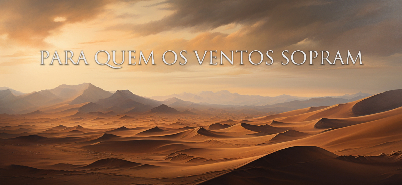

# O que é?
Para Quem os Ventos Sopram é um Role-Playing Game (RPG) baseado em Texto. O projeto foi desenvolvido pela matéria de Introdução à Hipermídia, disciplina obrigatória da grade curricular do curso de Imagem e Som da Universidade Federal de São Carlos. As aulas foram conduzidas pelo professor [Leonardo Antônio de Andrade Giani](https://buscatextual.cnpq.br/buscatextual/visualizacv.do;jsessionid=BBF39C14D568DFE8EE2B2B8C576C2A82.buscatextual_0), professor do curso de graduação de Imagem e Som, pesquisador em Narrativas Interativas, design de jogos de tabuleiro e RPGs, e co-criador do [Opera RPG](https://operarpg.com.br/sobre-o-opera/). 

# Matéria e Objetivo
- O que é Introdução à Hipermídia?
> A disciplina traz fundamentos de jogos e de jogos eletrônicos, incluindo um histórico dos jogos de tabuleiro, conceitos e classificações dos jogos, princípios básicos de animação e as etapas de produção de um jogo. Também são apresentados motores de jogos e princípios de implementação, com demonstrações práticas. Por fim, a disciplina finda com a apresentação de um projeto e da implementação de um jogo eletrônico simples, que consolida os conhecimentos adquiridos durante o aprendizado.


A matéria faz uso bibliográfias de obras como  Cultura da Convergência (1958), de Henry Jenkins, Hamlet on the holodeck: the future of narrative in cyberspace (1997), de Jannet Murray, entre outros, para que  o aluno consiga ter uma base na criaação de mundo da sua história.


- Para conhecer outros trabalhos feitos nessa matéria:
[Narrativas Interativas Ufscar](https://narrativas-interativas.ufscar.br/)


# O que significou para mim:
Nunca tinha pensado em programação como uma opção de trabalho, até ser colocado frente à essse desafio que despertou meu interesse na área. A possibilidade de criar conteúdo que interaja diretamente com o usuário, em conjunto com a compreensão de sintaxes e desafios envolvendo lógica, me proporcionaram muito interesse pela área.

# Processo de Criação da História:
### História:
A história de "Para Quem os Ventos Sopram" foi influenciada por obras como "Para Quem os Sinos Dobram" de Ernest Hemingway e o livro de Eclesiastes da Bíblia. Estas influências se refletem no título da história e na abordagem de temas como a incerteza, a futilidade da ação humana e a reflexão sobre o destino e as escolhas morais dos personagens.

### Ficha do Personagem:
Albert Burakh, protagonista da história, foi modelado a partir do Haruspex do jogo Pathologic 2, absorvendo influências tanto de sua profissão quanto do contexto de sua criação em meio a uma vila caracterizada por uma cultura isolada e singular. Esta comunidade, vista como estranha por aqueles de fora, contribui para moldar a personalidade e os desafios enfrentados por Albert ao longo da história.


### Imagens:
As imagens foram geradas pelo Midjourney, com atenção especial para garantir uma unidade estética coesa entre elas. Para capturar uma temática mais sombria e desesperançada, foram utilizados prompts como:

```
 Oil Painting
 Baroque
 Francisco Goya
 Chiaroscuro
 Goya's Black Paintings
```


# Sinopse: 
No coração impiedoso do deserto, onde o sol castiga a terra sem piedade, e as dunas cintilam como joias no horizonte, ergue-se a isolada comunidade dos Meístas. Albert Burakh, um homem cuja pele escura carrega a essência do sol inclemente, é o pilar desta vila oculta. Seu cabelo preto, cortado com precisão, reflete as sombras que dançam sobre as dunas douradas ao entardecer. Albert é um membro dedicado e querido da comunidade, um médico habilidoso que domina as antigas artes de cura transmitidas ao longo das gerações. Mas sob a aparente tranquilidade de Meístas, sussurros de um mundo além das dunas ecoam, um mundo que Meístas evitou por gerações. 

Neste mundo desolado, após um cataclismo ambiental, a humanidade enfrenta a dura realidade da sobrevivência individual. Os governos enfraqueceram, a confiança é uma moeda rara, e a bondade é vista como fraqueza. Carros são raros, e a competição é implacável. Nesse cenário sombrio, o Dr. Albert Burakh emerge como uma figura solitária, cercado por duas ideologias opostas. Os Meístas valorizam o altruísmo e a comunidade, enquanto o Quismo prioriza a sobrevivência individual acima de tudo. Quando uma doença sinistra ameaça a vila dos Meístas, Albert se vê diante de um dilema: cumprir seu dever com a comunidade ou adentrar o mundo hostil além das dunas em busca de ajuda. 

Enquanto a escuridão da noite envolve as ruínas do mundo antigo, o Dr. Albert Burakh parte em uma jornada que desafiará seus princípios e revelará segredos há muito esquecidos. Em meio à competição impiedosa e às ideologias conflitantes, ele enfrentará dilemas morais e surpreendentes revelações, embarcando em uma busca por cura que pode mudar o destino dos Meístas e desvendar os mistérios do mundo que se estende para além das dunas implacáveis.


